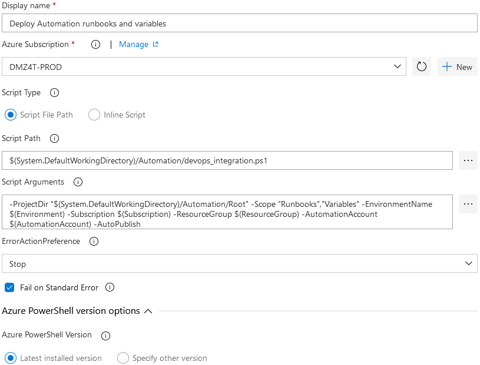

# Azure - Integration with source control
This repo contains Powershell scripts that demonstrates integration of Azure automation account and Azure Template Specs into DevOps source control and release pipeline.  
Main motivation for creation of this work were only basic capabilities of native integration of Azure Automation account with source control, namely:
* Lack of integration into DevOps pipeline; every repo update results in update of automation account
* Only runbooks are source-controlled, but not other assets - I particularly missed ability to control variables and Dsc configurations
* Only flat structure of repo (runbooks in subfolders are not managed)
* Dependency on PAT tokens
* Inability to manage variables and provide state-specific content for variables
* Inability to deliver different versions of runbooks to different stages/environments

Work then evpolved with interest of various development teams to manage more Azure areas from TFS
Sample runbook, variable and Dsc config included in this repo demonstrates how to effectively log runbook activity and telemetry data into AppInsights instance - just by providing instrumentation key in variable - makes it really easy to standardize runbook activity logging and get more out of AppInsights.

## Capabilities
Current implementation has the following features:
* Source control for runbooks, variables, Dsc configurations and Azure Template Specs
* All managed artefacts can be the same for all environments/stages, or can be specific for each environment/stage (this sample demonstrates this on AppInsights instrumentation key that is different for DEV/TEST/PROD environment)
  * Place implementation to Common folder, or stage-specific folder, depending on your needs
  * Stage-specific folders have priority when scripts look for implementation file
* Runbooks can be automatically published (global and per-runbook setting; runbook setting overrides global setting)
* Dsc Configurations can be automatically compiled and can be automatically published (global and per-runbook setting; configuration-level setting overrides global setting)
* All managed artefacts can be fully managed (auto-deleted from Azure when not found in source control)

Everything can be easily published to Azure via Azure PowerShell task from Release pipeline and parametrized from release variables, as shown on picture below:


Code relies on `Az.Resources` and `Az.Automation` PowerShell modules

## Folder structure for the root
```
Definitions
    ArmTemplates
        <TemplateName>.json
        <OtherTemplateName>.json
        ...
    Dsc
        <DscDefinitionName>.json
        <OtherDscDefinitionName>.json
        ...
    Runbooks
        <RunbookDefinitionName>.json
        <OtherRunbookDefinitionName>.json
        ...
    Variables
        <VariableDefinitionName>.json
        <OtherVariableDefinitionName>.json
        ...
Source
    Common
        ArmTemplates
            <commonArmTemplateSpecFile>
            ...
        Dsc
            <commonDscImplementationFile>
            <commonDscImplementationFile2>
            ...
        Runbooks
            <commonRunbookImplementationFile>
            <commonRunbookImplementationFile2>
            ...
        Variables
            <commonVariableContentFile>
            <commonVariableContentFile2>
            ...
    <Stage>
        ArmTemplates
            <stage-specificArmTemplateSpecFile>
            ...
        Dsc
            <stage-SpecificDscImplementationFile>
            <stage-SpecificDscImplementationFile2>
            ...
         Runbooks
            <stage-SpecificRunbookImplementationFile>
            <stage-SpecificRunbookImplementationFile2>
            ...
       Variables
            <stage-SpecificVariableContentFile>
            <stage-SpecificVariableContentFile2>
            ...
    <Stage2>
        ...
```
Sample in this repo contains:
- Common runbook `Init.ps1` with shared code
- Stages DEV and TEST with stage-specific variable Sample-Variable, stage-specific runbook Sample-Runbook.ps1, stage-specific Dsc configuration TLS12.ps1, and common Arm Template Spec StorageAccount

## Concept
Concept relies on JSON files that describe which and how runbooks, variables and Dsc configurations are managed in automation account. Source control can contain more files - only runbooks and variables specified in JSON definition files are imported to automation account and managed there.  
JSON definition files are stored in Definitions folder as shown in this sample.
Integration script executed by DevOps agent as a part of Release pipeline via [Azure Powershell](https://docs.microsoft.com/en-us/azure/devops/pipelines/tasks/deploy/azure-powershell?view=azure-devops) task reads JSON definitions and performs deployment - see below for details.

### Schema of definition files
Runbook definition:
```json
{
    "Name": "<Name of the runbook as appears in automation account>",
    "Implementation": "<FileName in Sources that contains implementation of runbook>",
    "Type": "<type of runbook, e.g. PowerShell>",
    "AutoPublish": "true or false - if the runbook shall be automatically published"
}
```
Variable definition:
```json
{
    "Name": "<Name of the variable as appears in automation account>",
    "Description": "<description of variable>",
    "Encrypted": "true or false - if the variable shall be encrypted>",
    "Content": "<FileName in Sources that contains content of variable>"
}
```
Dsc configuration definition:
```json
{
    "Implementation": "<FileName in Sources that contains the configuration definition>",
    "AutoPublish": "true or false - if the configuration shall be automatically published",
    "AutoCompile": "true or false - if the configuration shall be automatically compiled",
    "Parameters": "object that specifies configuration parameters. Parameters are passed to configuration for compilation"
}
```
Arm Template Spec definition:
```json
{
    "Name": "<name of Arm Template Spec to show in Azure Portal>",
    "Description": "<description of Arm Template Spec to show in Azure Portal>" ,
    "TemplateImplementation": "<FileName in Sources that contains content of Arm template>",
    "ResourceGroupName":"Name of resource group where tempplate shall be published",
    "SubscriptionName":"Name of subscription where resource group is located",
    "ShareTargetGroupName":"Name of AAD group that is allowed to use the template spec",
    "Version":"Version of the template spec to show in Azure Portal"
}
```
### Processing logic
Scripts looks for definition of runbook/variable/Dsc/ArmTemplate in respective subfolders under Definitions folder and:
- looks for implementation file in Stage-specific folder
- if found, it's used for import of runbook/variable/Dsc/ArmTemplate content
- if not found in Stage-specific, script looks for the same file in Common folder
- if found, it's used for import
- if not found, warning is logged

So logic of looking for artecats is the same for all artefacts types - environment/stage specific implementations always have priority.

## Integration script
Integration with DevOps is implemented by Manage-\*.ps1 script. It's supposed to be run by standard Azure PowerShell task in DevOps - note that script uses **Az Powershell** module, so Azure Powershell task version should be at least 4.* (previous versions rely on AzureRm Powershell instead of Az Powershell).

Typical usage and command line that uses pipeline variables:
```
$(System.DefaultWorkingDirectory)/Manage-AutomationAccount.ps1 -ProjectDir "$(System.DefaultWorkingDirectory)\Root" -Scope 'Runbooks','Variables','Dsc' -EnvironmentName $(EnvironmentName) -ResourceGroup $(ResourceGroup) -AutomationAccount $(AutomationAccount) -AutoPublish
```
```
$(System.DefaultWorkingDirectory)/Automation/Manage-ArmTemplateSpecs.ps1 -ProjectDir "$(System.DefaultWorkingDirectory)/Root" -EnvironmentName $(Environment) -FullSync
```
Above samples load environment name and other parameters from variables defined for DevOps release, and import runbooks, variables, Dsc Configurations and Arm Template Specs as defined in JSON definition files in repo to Azure. Runbooks and Dsc Configurations are automatically published (if definition file does not specify otherwise)

Running task inside DevOps pipeline produces output simlar to the below upon successful finish:
```
2020-06-25T10:39:33.0686398Z ##[section]Starting: Run devops_integration.ps1
2020-06-25T10:39:33.1350708Z ==============================================================================
2020-06-25T10:39:33.1351037Z Task         : Azure PowerShell
2020-06-25T10:39:33.1351193Z Description  : Run a PowerShell script within an Azure environment
2020-06-25T10:39:33.1351316Z Version      : 4.0.13
2020-06-25T10:39:33.1351421Z Author       : Microsoft Corporation
2020-06-25T10:39:33.1351552Z Help         : [More Information](https://go.microsoft.com/fwlink/?LinkID=613749)
2020-06-25T10:39:33.1351679Z ==============================================================================
2020-06-25T10:39:39.5587719Z Added TLS 1.2 in session.
2020-06-25T10:39:47.2609508Z ##[command]Import-Module -Name C:\Program Files\WindowsPowerShell\Modules\Az.Accounts\1.7.3\Az.Accounts.psd1 -Global
2020-06-25T10:39:52.9165193Z ##[command]Clear-AzContext -Scope Process
2020-06-25T10:39:55.7821284Z ##[command]Clear-AzContext -Scope CurrentUser -Force -ErrorAction SilentlyContinue
2020-06-25T10:39:56.4330692Z ##[command]Connect-AzAccount -ServicePrincipal -Tenant *** -Credential System.Management.Automation.PSCredential -Environment AzureCloud
2020-06-25T10:40:00.0905493Z ##[command] Set-AzContext -SubscriptionId *** -TenantId ***
2020-06-25T10:40:01.1408755Z ##[command]& 'C:\***\Automation\devops_integration.ps1' -ProjectDir "C:\***/Automation" -EnvironmentName DEV -ResourceGroup myRG -AutomationAccount myAccount -AutoPublish
2020-06-25T10:40:01.2307977Z Processing Runbooks
2020-06-25T10:40:01.2826969Z Importing runbook Sample-Runbook; Source: C:\***/Automation\Source\DEV\Runbooks\Sample-Runbook.ps1; Publish: True
2020-06-25T10:43:12.5687203Z Importing runbook Utils; Source: C:\***/Automation\Source\Common\Runbooks\Utils.ps1; Publish: True
2020-06-25T10:44:18.0574966Z Updating existing variables
2020-06-25T10:44:18.0944373Z Sample-Variable managed -> updating variable
2020-06-25T10:44:27.6900367Z ##[command]Disconnect-AzAccount -Scope Process -ErrorAction Stop
2020-06-25T10:44:28.0766231Z ##[command]Clear-AzContext -Scope Process -ErrorAction Stop
2020-06-25T10:44:29.1959197Z ##[section]Finishing: Run devops_integration.ps1
```

Script parameters:  
| Parameter             |  Meaning |
|-----------------------|----------|
|  **Scope**            |  List of entities to be processed. Valid entity names are _Dsc_, _Runbooks_' and _Variables_ |
|  **ProjectDir**       |  Root folder of repository |
|  **EnvironmentName**  |  Name of the stage/environment we're deploying |
|  **ResourceGroup**    |  Name of the resource group where automation account is located  |
| **AutomationAccount** |  Name of automation account that we deploy to |
|  **FullSync**         |  Whether or not to remove any existing, source-uncontrolled runbooks, variables and Dsc configs from automation account  |
|  **AutoPublish**      |  Whether to automatically publish runbooks and Dsc configs. This can be overriden in runbook / Dsc definition file  |


## Limitations
Current implementation as shown in Manage-AutomationAccount script manages just runbooks, variables and Dsc Configurations, but not other assets in automation account - for many assets it's not good idea to store them in source control.
> If you have good use case for manageement of other assets, let me know

Variable encryption status cannot be changed when variable already exists. To change encryption status, you have to delete the variable manually in automation account and then run deployment again with updated Encryption in variable definition file.

Integration is supposed to work with any runbook type, however it was heavily tested with PowerShell runbooks only.
> Looking for testers with other runbook types.

Management of Arm Template Specs is implemented in Manage-ArmTemplateSpecs script.
Currently, only variables of type [string] are supported; support for other variable types may come in next release.

Enjoy!
